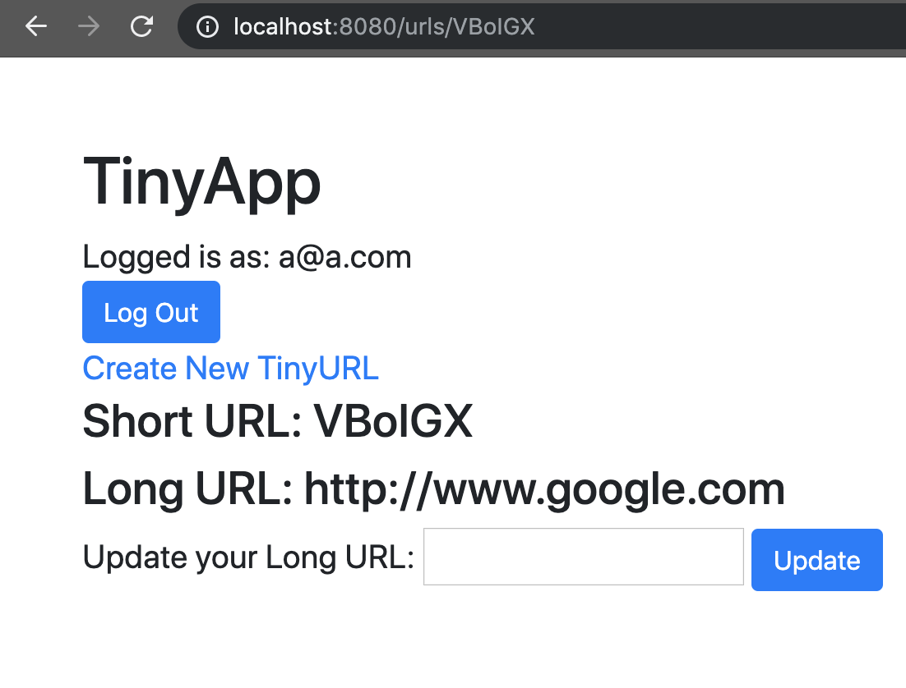

# About the App

The app is a full stack web application built with Node and Express that allows users to shorten long URLs.

# Screenshots

# Dependencies

bcrypt
body-parser
cookie-session
ejs
express
Node.js

# Getting Started

Install all dependencies using the `bash npm install` command.
Run the development web server using the `bash node express_server.js` command.
